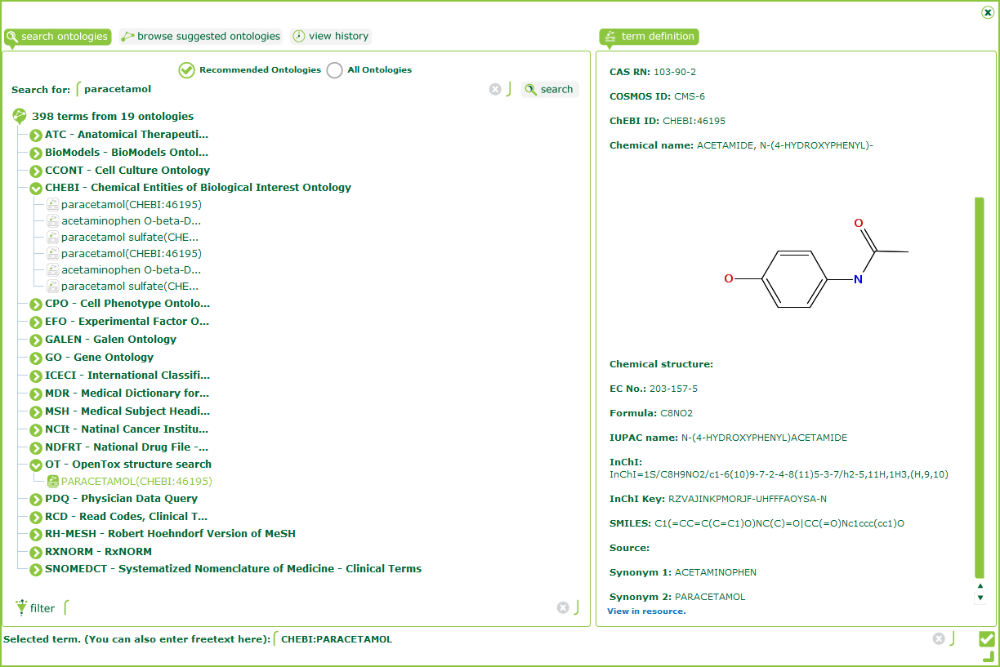

opentox-isa-plugin
==================

ISACreator 1.7.x plugin providing access to OpenTox REST services. 

Distributed along with [toxbank-isa-plugin](https://github.com/ToxBank/toxbank-isa-plugin) with the SEURAT-1 Customized ISACreator [Windows setup](http://www.ideaconsult.net/downloads/ISAcreator.SEURAT/ISAcreator.SEURAT-v1.7.2-setup.exe),
[ZIP](http://www.ideaconsult.net/downloads/ISAcreator.SEURAT/ISAcreator.SEURAT-v1.7.2.zip) 

Used for ISA-TAB data preparation in [SEURAT-1](http://www.seurat-1.eu/) cluster projects.

